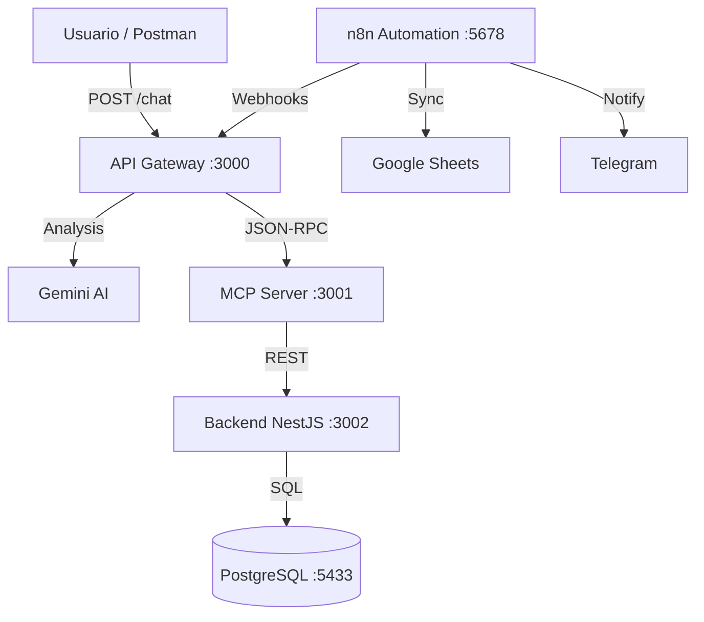

# MCP Gestor de Reservas IA

Sistema de gestión inteligente de reservas y usuarios utilizando **Model Context Protocol (MCP)** con arquitectura de microservicios y orquestación de flujos con **n8n**.

## 🏗️ Arquitectura



## ✨ Características Principales

- 🤖 **Chatbot Inteligente**: Gemini AI comprende lenguaje natural para gestionar reservas.
- 🔧 **MCP (Model Context Protocol)**: Estandariza la conexión entre la IA y las herramientas del sistema.
- 🔄 **Automatización con n8n**: Flujos de trabajo para notificaciones, sincronización y alertas.
- 💾 **Persistencia PostgreSQL**: Base de datos relacional robusta.
- 🎯 **Function Calling**: La IA decide autónomamente cuándo ejecutar herramientas.

## 📋 Requisitos Previos

- **Node.js** 18+
- **Docker** y **Docker Compose**
- **Gemini API Key** (Obtenla en [Google AI Studio](https://aistudio.google.com/))

## 🚀 Inicio Rápido

### 1. Instalación
Ejecuta el script para instalar dependencias en todos los servicios:
```powershell
npm run install:all
```

### 2. Configuración
Crea el archivo `.env` en `apps/api-gateway/` (usa `.env.example` como guía):
```env
GEMINI_API_KEY=tu_api_key_aqui
MCP_SERVER_URL=http://localhost:3001
```

### 3. Ejecución
Inicia todo el entorno (Base de datos, n8n y microservicios) con un solo comando en PowerShell:
```powershell
./start-dev.ps1
```
*Este script levantará los contenedores de Docker y abrirá terminales para cada servicio.*

## 🧪 Guía de Verificación y Uso

Sigue estos pasos para confirmar que todo el sistema funciona correctamente.

### Paso 1: Verificar Servicios Activos
Asegúrate de que puedes acceder a las siguientes URLs:

- **Backend (API)**: `http://localhost:3002/usuarios`
- **MCP Server**: `http://localhost:3001/health`
- **API Gateway**: `http://localhost:3000/health` (o raíz)
- **n8n Automation**: `http://localhost:5678`

**Credenciales n8n:**
- **Usuario:** `admin`
- **Contraseña:** `uleam2025`

### Paso 2: Crear Datos de Prueba (Usuario)
Antes de reservar, debe existir un usuario. Usa Postman o tu terminal:

**Crear Usuario:**
```bash
curl -X POST http://localhost:3002/usuarios \
  -H "Content-Type: application/json" \
  -d '{
    "nombre": "Juan Perez",
    "email": "juan@test.com",
    "telefono": "0991234567"
  }'
```

### Paso 3: Probar el Chatbot (Reserva)
Interactúa con la IA para crear una reserva naturalemente.

**Endpoint:** `POST http://localhost:3000/chat`
**Body:**
```json
{
  "message": "Quiero reservar una sala para Juan Perez para el próximo viernes a las 10am"
}
```

**Respuesta esperada:**
La IA debería responder confirmando que encontró al usuario y creó la reserva con un ID específico.

### Paso 4: Validar Flujos n8n
1. Accede a n8n (`http://localhost:5678`).
2. Verifica que los workflows estén activos (Notificaciones, Sincronización, Alertas).
3. Si los workflows están configurados, la creación de la reserva debería disparar:
   - Una notificación (Telegram/Email).
   - Un registro en Google Sheets (si está configurado).

## 🛠️ Herramientas Disponibles (MCP Tools)

| Herramienta | Descripción | Parametros |
|---|---|---|
| `buscar_usuario` | Encuentra usuarios por nombre o email | `query`: string |
| `crear_reserva` | Registra una nueva reserva | `usuarioId`: number, `fecha`: string, `detalle`: string |
| `actualizar_reserva` | Modifica una reserva existente | `id`: number, `estado`: string |
| `buscar_reserva` | Consulta reservas de un usuario | `usuarioId`: number |

## 📂 Estructura del Proyecto

```
.
├── apps/
│   ├── api-gateway/      # NestJS + Gemini Client (Chat Logic)
│   ├── backend/          # NestJS + TypeORM + Postgres (Core Data)
│   ├── mcp-server/       # MCP Server (Bridge IA <-> Backend)
│   └── n8n/              # Configuración y Workflows de n8n
├── data/                 # Volúmenes de datos
├── start-dev.ps1         # Script de arranque automático
└── package.json          # Workspace config
```

---
**Nota:** Si encuentras errores de conexión a la base de datos, asegúrate de que el puerto `5433` no esté ocupado y que los contenedores de Docker estén corriendo (`docker ps`).
